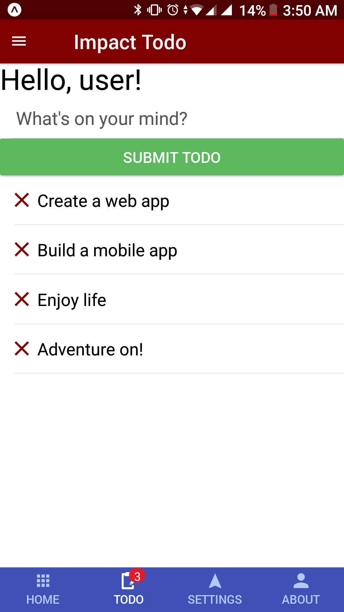

# Impact Todo Mobile React Native

Impact Todo mobile application frontend with React, React Native, & Redux. Also access the backend API.



## Development

Install dependencies:

```sh
yarn
```

Edit the `.env` file based on your API URL:

```
REACT_APP_API_URL=http://localhost:3000
```

Then start the development server via Expo:

```sh
# Starts the development server so you can open your app in the Expo app on your phone.
yarn start
```

Platform specific:

```sh
# Starts the development server and loads your app on a connected Android device or emulator. Requires Android build tools.
yarn run android

# Starts the development server and loads your app in an iOS simulator. Mac only, requires Xcode.
yarn run ios
```

## Build

Build the app to `/build` folder:

```sh
yarn build
```

## Test

Test components:

```sh
yarn test

# Then Press a to run all tests.
```
